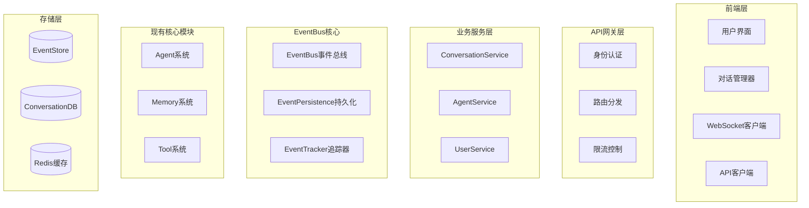
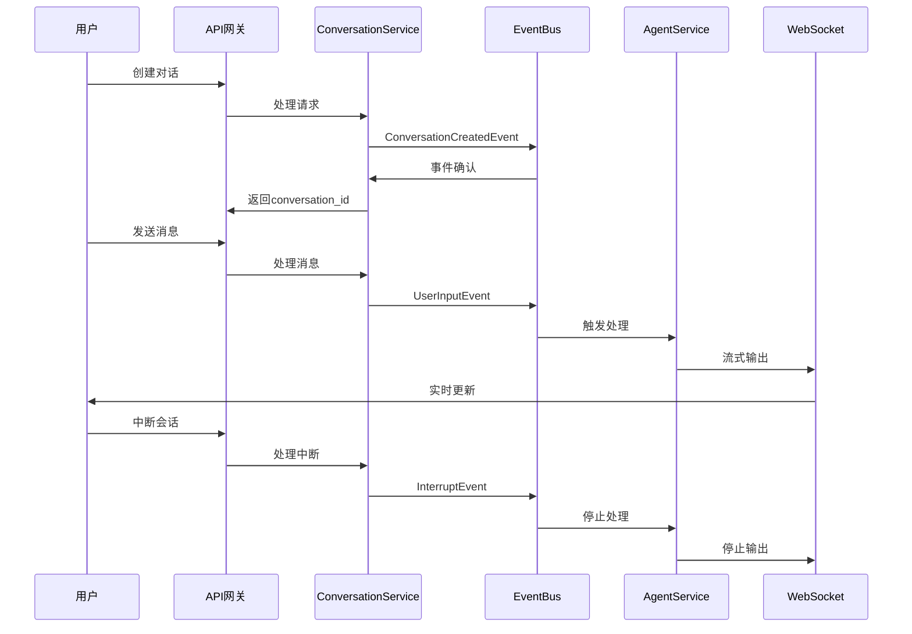

# OpenManus 事件驱动多用户对话系统设计文档

## 1. 系统概述

### 1.1 设计目标
构建一个基于事件驱动架构的多用户对话系统，实现：
- **数据原子性**: 所有关键操作都通过EventBus流转并自动持久化
- **完整溯源**: 从conversation创建开始的所有事件都可追踪
- **实时交互**: 支持流式输出和会话中断功能
- **多用户支持**: 用户身份认证和多对话窗口管理

### 1.2 核心架构原则
- **保持现有架构**: Agent、Memory、Tool等核心模块的紧耦合关系不变
- **事件驱动集成**: 通过EventBus实现数据流转和组件解耦
- **渐进式改造**: 在现有代码基础上融入事件系统，避免大规模重构

## 2. 系统架构设计

### 2.1 整体架构图



### 2.2 事件流转架构



## 3. 核心组件设计

### 3.1 事件系统

#### 3.1.1 事件基础类型
```python
class BaseEvent(BaseModel):
    event_id: str = Field(default_factory=lambda: str(uuid.uuid4()))
    event_type: str = Field(...)
    timestamp: datetime = Field(default_factory=datetime.now)

    # 追踪信息
    conversation_id: str = Field(...)
    user_id: Optional[str] = None
    session_id: Optional[str] = None

    # 关系信息
    parent_events: List[str] = Field(default_factory=list)
    root_event_id: Optional[str] = None

    # 事件数据
    data: Dict[str, Any] = Field(default_factory=dict)
    metadata: Dict[str, Any] = Field(default_factory=dict)

    # 处理状态
    status: EventStatus = Field(default=EventStatus.PENDING)
    processed_by: List[str] = Field(default_factory=list)
```

#### 3.1.2 具体事件类型
```python
# 对话生命周期事件
class ConversationCreatedEvent(BaseEvent):
    """对话创建事件"""

class ConversationClosedEvent(BaseEvent):
    """对话关闭事件"""

# 用户交互事件
class UserInputEvent(BaseEvent):
    """用户输入事件"""

class InterruptEvent(BaseEvent):
    """中断事件"""

# 智能体处理事件
class AgentStepStartEvent(BaseEvent):
    """智能体开始处理事件"""

class AgentStepCompleteEvent(BaseEvent):
    """智能体完成处理事件"""

class AgentResponseEvent(BaseEvent):
    """智能体响应事件"""

# 工具执行事件
class ToolExecutionEvent(BaseEvent):
    """工具执行事件"""

class ToolResultEvent(BaseEvent):
    """工具结果事件"""

# 系统事件
class SystemErrorEvent(BaseEvent):
    """系统错误事件"""

class SystemPerformanceEvent(BaseEvent):
    """系统性能监控事件"""
```

### 3.2 EventBus管理器

#### 3.2.1 全局事件总线管理器
```python
class EventBusManager:
    """单例事件总线管理器"""

    _instance: Optional['EventBusManager'] = None
    _bus: Optional[EventBus] = None

    async def initialize(self, bus_name: str = "OpenManus-EventBus"):
        """初始化全局事件总线"""

    async def publish(self, event: BaseEvent) -> bool:
        """发布事件到全局总线"""

    async def subscribe(self, handler: BaseEventHandler) -> bool:
        """订阅事件处理器"""

    def get_stats(self) -> Dict[str, Any]:
        """获取事件总线统计信息"""

    async def shutdown(self):
        """优雅关闭事件总线"""

# 全局实例
event_manager = EventBusManager()
```

#### 3.2.2 事件持久化和追踪
```python
class EventPersistence:
    """事件持久化处理器"""

    async def store_event(self, event: BaseEvent):
        """存储事件到数据库"""

    async def get_conversation_events(self, conversation_id: str) -> List[BaseEvent]:
        """获取对话的所有事件"""

class EventTracker:
    """事件追踪器"""

    async def track_event_relations(self, event: BaseEvent):
        """追踪事件关系"""

    async def get_event_chain(self, event_id: str) -> List[BaseEvent]:
        """获取事件链"""

    async def get_related_events(self, event_id: str) -> List[BaseEvent]:
        """获取相关事件"""
```

### 3.3 现有系统集成

#### 3.3.1 Agent系统集成
```python
class EventAwareMixin:
    """事件感知混入类"""

    async def publish_event(self, event: BaseEvent) -> bool:
        """发布事件"""
        if not event.source:
            event.source = getattr(self, 'name', self.__class__.__name__)
        return await event_manager.publish(event)

    async def publish_state_change(self, old_state: str, new_state: str):
        """发布状态变更事件"""

# 现有Agent类集成
class BaseAgent(EventAwareMixin):  # 添加混入类
    # 原有代码保持不变

    async def run(self, request: Optional[str] = None) -> str:
        # 发布开始事件
        await self.publish_event(AgentStepStartEvent(
            agent_name=self.name,
            conversation_id=getattr(self, 'conversation_id', 'unknown')
        ))

        # 原有逻辑
        result = await self._original_run(request)

        # 发布完成事件
        await self.publish_event(AgentStepCompleteEvent(
            agent_name=self.name,
            result=result
        ))

        return result
```

#### 3.3.2 Tool系统集成
```python
class ToolCollection:
    async def execute(self, *, name: str, tool_input: Dict[str, Any] = None) -> ToolResult:
        # 发布工具执行开始事件
        start_event = ToolExecutionEvent(
            tool_name=name,
            status=ToolExecutionStatus.STARTED,
            parameters=tool_input or {}
        )
        await event_manager.publish(start_event)

        try:
            # 原有执行逻辑
            result = await self._original_execute(name=name, tool_input=tool_input)

            # 发布执行完成事件
            complete_event = ToolExecutionEvent(
                tool_name=name,
                status=ToolExecutionStatus.COMPLETED,
                parameters=tool_input or {},
                result=result
            )
            await event_manager.publish(complete_event)

            return result

        except Exception as e:
            # 发布执行失败事件
            error_event = ToolExecutionEvent(
                tool_name=name,
                status=ToolExecutionStatus.FAILED,
                parameters=tool_input or {},
                error=str(e)
            )
            await event_manager.publish(error_event)
            raise
```

## 4. API接口设计

### 4.1 RESTful API

#### 4.1.1 用户认证
```
POST   /auth/login                    # 用户登录
POST   /auth/logout                   # 用户登出
GET    /auth/profile                  # 获取用户信息
```

#### 4.1.2 对话管理
```
GET    /users/{id}/conversations      # 获取用户的所有对话
POST   /conversations                 # 创建新对话
GET    /conversations/{id}            # 获取对话信息
DELETE /conversations/{id}            # 删除对话
PUT    /conversations/{id}            # 更新对话信息
```

#### 4.1.3 消息处理
```
POST   /conversations/{id}/messages   # 发送消息
POST   /conversations/{id}/interrupt  # 中断当前处理
GET    /conversations/{id}/history    # 获取对话历史
GET    /conversations/{id}/events     # 获取对话事件流
```

#### 4.1.4 事件溯源
```
GET    /events/{id}                   # 获取单个事件详情
GET    /events/{id}/trace             # 事件溯源查询
GET    /events/{id}/related           # 获取相关事件
```

### 4.2 WebSocket接口

#### 4.2.1 实时通信
```javascript
// 连接WebSocket
const ws = new WebSocket(`ws://api.example.com/conversations/${conversationId}/stream`);

// 接收事件类型
{
    "type": "agent.response.chunk",     // 流式响应片段
    "type": "agent.response.complete",  // 响应完成
    "type": "agent.step.start",         // 处理开始
    "type": "tool.execution",           // 工具执行
    "type": "error",                    // 错误事件
    "type": "interrupt.confirmed"       // 中断确认
}
```

## 5. 数据库设计

### 5.1 事件存储表
```sql
CREATE TABLE events (
    id VARCHAR(36) PRIMARY KEY,
    event_type VARCHAR(100) NOT NULL,
    conversation_id VARCHAR(36),
    user_id VARCHAR(36),
    session_id VARCHAR(36),
    timestamp TIMESTAMP DEFAULT CURRENT_TIMESTAMP,

    -- 关系信息
    parent_events JSON,
    root_event_id VARCHAR(36),

    -- 事件数据
    data JSON,
    metadata JSON,

    -- 处理状态
    status ENUM('pending', 'processing', 'completed', 'failed', 'cancelled'),
    processed_by JSON,
    error_message TEXT,

    -- 索引
    INDEX idx_conversation_id (conversation_id),
    INDEX idx_user_id (user_id),
    INDEX idx_timestamp (timestamp),
    INDEX idx_event_type (event_type)
);
```

### 5.2 对话表
```sql
CREATE TABLE conversations (
    id VARCHAR(36) PRIMARY KEY,
    user_id VARCHAR(36) NOT NULL,
    title VARCHAR(255),
    status ENUM('active', 'paused', 'closed') DEFAULT 'active',
    created_at TIMESTAMP DEFAULT CURRENT_TIMESTAMP,
    updated_at TIMESTAMP DEFAULT CURRENT_TIMESTAMP ON UPDATE CURRENT_TIMESTAMP,

    -- 元数据
    metadata JSON,

    -- 索引
    INDEX idx_user_id (user_id),
    INDEX idx_status (status),
    INDEX idx_created_at (created_at)
);
```

### 5.3 用户表
```sql
CREATE TABLE users (
    id VARCHAR(36) PRIMARY KEY,
    username VARCHAR(50) UNIQUE NOT NULL,
    email VARCHAR(100) UNIQUE NOT NULL,
    password_hash VARCHAR(255) NOT NULL,
    created_at TIMESTAMP DEFAULT CURRENT_TIMESTAMP,
    last_login TIMESTAMP,

    -- 用户配置
    preferences JSON,

    -- 索引
    INDEX idx_username (username),
    INDEX idx_email (email)
);
```

## 6. 前端设计

### 6.1 组件架构
```javascript
// 主要组件
ConversationList        // 对话列表
ConversationView        // 对话视图
MessageInput           // 消息输入
StreamingMessage       // 流式消息显示
InterruptButton        // 中断按钮
EventTimeline          // 事件时间线（调试用）

// 状态管理
ConversationStore      // 对话状态管理
MessageStore          // 消息状态管理
WebSocketManager      // WebSocket连接管理
```

### 6.2 核心交互逻辑
```javascript
class ConversationManager {
    async sendMessage(conversationId, message) {
        // 发送消息
        const response = await api.post(`/conversations/${conversationId}/messages`, {
            message: message
        });

        // 开始监听流式响应
        this.startStreamListening(conversationId);
    }

    async interruptConversation(conversationId) {
        // 发送中断请求
        await api.post(`/conversations/${conversationId}/interrupt`);

        // 停止流式监听
        this.stopStreamListening(conversationId);

        // 显示输入框供用户输入新指令
        this.showMessageInput();
    }

    startStreamListening(conversationId) {
        const ws = new WebSocket(`ws://api/conversations/${conversationId}/stream`);

        ws.onmessage = (event) => {
            const data = JSON.parse(event.data);

            switch(data.type) {
                case 'agent.response.chunk':
                    this.appendMessageChunk(data.content);
                    break;
                case 'agent.response.complete':
                    this.completeMessage();
                    break;
                case 'interrupt.confirmed':
                    this.handleInterruptConfirmed();
                    break;
            }
        };
    }
}
```

### 6.3 消息渲染逻辑
```javascript
function renderConversationHistory(events) {
    // 过滤出用户输入和智能体响应事件
    const messageEvents = events.filter(event =>
        ['user.input', 'agent.response', 'interrupt'].includes(event.event_type)
    );

    // 按时间排序
    const sortedEvents = messageEvents.sort((a, b) =>
        new Date(a.timestamp) - new Date(b.timestamp)
    );

    // 渲染消息
    return sortedEvents.map(event => {
        switch(event.event_type) {
            case 'user.input':
                return {
                    role: 'user',
                    content: event.data.message,
                    timestamp: event.timestamp,
                    eventId: event.id
                };
            case 'agent.response':
                return {
                    role: 'assistant',
                    content: event.data.response,
                    timestamp: event.timestamp,
                    eventId: event.id,
                    interrupted: event.status === 'interrupted'
                };
            case 'interrupt':
                return {
                    role: 'system',
                    content: '会话已中断',
                    timestamp: event.timestamp,
                    eventId: event.id
                };
        }
    });
}
```

## 7. 部署和运维

### 7.1 系统部署架构
```yaml
# docker-compose.yml
version: '3.8'
services:
  frontend:
    build: ./frontend
    ports:
      - "3000:3000"

  api-gateway:
    build: ./api-gateway
    ports:
      - "8000:8000"
    depends_on:
      - conversation-service
      - user-service

  conversation-service:
    build: ./services/conversation
    depends_on:
      - eventbus
      - database

  agent-service:
    build: ./services/agent
    depends_on:
      - eventbus

  eventbus:
    build: ./eventbus
    depends_on:
      - redis
      - database

  database:
    image: mysql:8.0
    environment:
      MYSQL_DATABASE: openmanus
      MYSQL_ROOT_PASSWORD: password

  redis:
    image: redis:7-alpine
```

### 7.2 监控和日志
```python
# 事件监控处理器
class MonitoringHandler(BaseEventHandler):
    name = "monitoring_handler"

    async def handle(self, event: BaseEvent) -> bool:
        # 记录事件指标
        metrics.increment(f"events.{event.event_type}")
        metrics.histogram("event.processing_time", event.processing_time)

        # 错误告警
        if event.status == EventStatus.FAILED:
            await self.send_alert(event)

        return True

# 性能监控
class PerformanceMonitor:
    async def track_conversation_metrics(self, conversation_id: str):
        events = await event_store.get_conversation_events(conversation_id)

        # 计算响应时间
        response_times = self.calculate_response_times(events)

        # 统计事件类型分布
        event_distribution = self.analyze_event_distribution(events)

        # 发送监控数据
        await self.send_metrics(response_times, event_distribution)
```

## 8. 测试策略

### 8.1 单元测试
```python
class TestEventBus:
    async def test_event_publishing(self):
        """测试事件发布功能"""
        event = UserInputEvent(
            conversation_id="test_conv",
            user_id="test_user",
            message="test message"
        )

        result = await event_manager.publish(event)
        assert result is True

        # 验证事件已持久化
        stored_event = await event_store.get_event(event.event_id)
        assert stored_event is not None

    async def test_event_tracing(self):
        """测试事件追踪功能"""
        # 创建事件链
        parent_event = ConversationCreatedEvent(conversation_id="test_conv")
        child_event = UserInputEvent(
            conversation_id="test_conv",
            parent_events=[parent_event.event_id]
        )

        await event_manager.publish(parent_event)
        await event_manager.publish(child_event)

        # 验证事件链追踪
        chain = await event_tracker.get_event_chain(child_event.event_id)
        assert len(chain) == 2
        assert chain[0].event_id == parent_event.event_id
```

### 8.2 集成测试
```python
class TestConversationFlow:
    async def test_complete_conversation_flow(self):
        """测试完整对话流程"""
        # 1. 创建对话
        conversation = await conversation_service.create_conversation("test_user")

        # 2. 发送消息
        await conversation_service.send_message(
            conversation.id,
            "帮我写一个排序算法"
        )

        # 3. 验证事件流
        events = await event_store.get_conversation_events(conversation.id)
        assert any(e.event_type == "conversation.created" for e in events)
        assert any(e.event_type == "user.input" for e in events)

        # 4. 测试中断功能
        await conversation_service.interrupt_conversation(conversation.id)

        # 5. 发送新消息
        await conversation_service.send_message(
            conversation.id,
            "请使用Java版本"
        )

        # 6. 验证完整事件链
        final_events = await event_store.get_conversation_events(conversation.id)
        assert any(e.event_type == "interrupt" for e in final_events)
```

## 9. 性能优化

### 9.1 事件处理优化
```python
# 批量事件处理
class BatchEventProcessor:
    def __init__(self, batch_size=100, flush_interval=1.0):
        self.batch_size = batch_size
        self.flush_interval = flush_interval
        self.event_buffer = []

    async def add_event(self, event: BaseEvent):
        self.event_buffer.append(event)

        if len(self.event_buffer) >= self.batch_size:
            await self.flush_events()

    async def flush_events(self):
        if self.event_buffer:
            await event_store.batch_store(self.event_buffer)
            self.event_buffer.clear()

# 事件索引优化
class EventIndexOptimizer:
    async def optimize_conversation_index(self, conversation_id: str):
        """优化对话事件索引"""
        events = await event_store.get_conversation_events(conversation_id)

        # 创建时间索引
        time_index = self.create_time_index(events)

        # 创建类型索引
        type_index = self.create_type_index(events)

        # 存储优化索引
        await cache.set(f"conv_time_idx:{conversation_id}", time_index)
        await cache.set(f"conv_type_idx:{conversation_id}", type_index)
```

### 9.2 缓存策略
```python
# 多级缓存
class ConversationCache:
    def __init__(self):
        self.l1_cache = {}  # 内存缓存
        self.l2_cache = redis_client  # Redis缓存

    async def get_conversation_events(self, conversation_id: str):
        # L1缓存查找
        if conversation_id in self.l1_cache:
            return self.l1_cache[conversation_id]

        # L2缓存查找
        cached_events = await self.l2_cache.get(f"conv_events:{conversation_id}")
        if cached_events:
            events = json.loads(cached_events)
            self.l1_cache[conversation_id] = events
            return events

        # 数据库查找
        events = await event_store.get_conversation_events(conversation_id)

        # 写入缓存
        await self.l2_cache.setex(
            f"conv_events:{conversation_id}",
            3600,  # 1小时过期
            json.dumps(events, default=str)
        )
        self.l1_cache[conversation_id] = events

        return events
```

## 10. 安全考虑

### 10.1 事件数据安全
```python
# 敏感数据脱敏
class EventSanitizer:
    SENSITIVE_FIELDS = ['password', 'token', 'api_key', 'secret']

    def sanitize_event(self, event: BaseEvent) -> BaseEvent:
        """脱敏事件中的敏感数据"""
        sanitized_data = self._sanitize_dict(event.data)
        sanitized_metadata = self._sanitize_dict(event.metadata)

        event.data = sanitized_data
        event.metadata = sanitized_metadata
        return event

    def _sanitize_dict(self, data: Dict) -> Dict:
        sanitized = {}
        for key, value in data.items():
            if key.lower() in self.SENSITIVE_FIELDS:
                sanitized[key] = "***REDACTED***"
            elif isinstance(value, dict):
                sanitized[key] = self._sanitize_dict(value)
            else:
                sanitized[key] = value
        return sanitized
```

### 10.2 访问控制
```python
# 事件访问权限控制
class EventAccessController:
    async def can_access_event(self, user_id: str, event: BaseEvent) -> bool:
        """检查用户是否有权限访问事件"""
        # 用户只能访问自己的对话事件
        if event.user_id and event.user_id != user_id:
            return False

        # 检查对话权限
        if event.conversation_id:
            conversation = await conversation_service.get_conversation(event.conversation_id)
            if conversation.user_id != user_id:
                return False

        return True

    async def filter_events_by_permission(self, user_id: str, events: List[BaseEvent]) -> List[BaseEvent]:
        """过滤用户有权限访问的事件"""
        accessible_events = []
        for event in events:
            if await self.can_access_event(user_id, event):
                accessible_events.append(event)
        return accessible_events
```

## 11. 总结

本设计文档提供了一个完整的事件驱动多用户对话系统架构，主要特点包括：

1. **数据原子性**: 所有关键操作都通过EventBus流转并自动持久化
2. **完整溯源**: 支持从任意事件追踪完整的操作链路
3. **实时交互**: 支持流式输出和会话中断功能
4. **渐进式集成**: 在现有架构基础上融入事件系统，避免大规模重构
5. **高性能**: 通过批量处理、多级缓存等优化策略保证系统性能
6. **安全可靠**: 完善的权限控制和数据安全机制

该架构设计既满足了多用户对话系统的功能需求，又保持了系统的可扩展性和可维护性，为后续功能扩展提供了坚实的基础。
