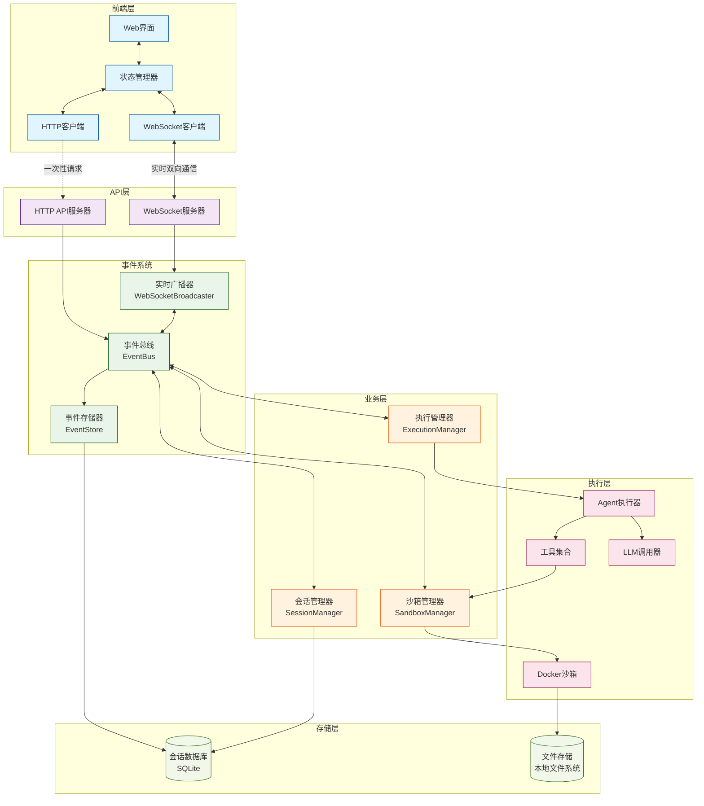
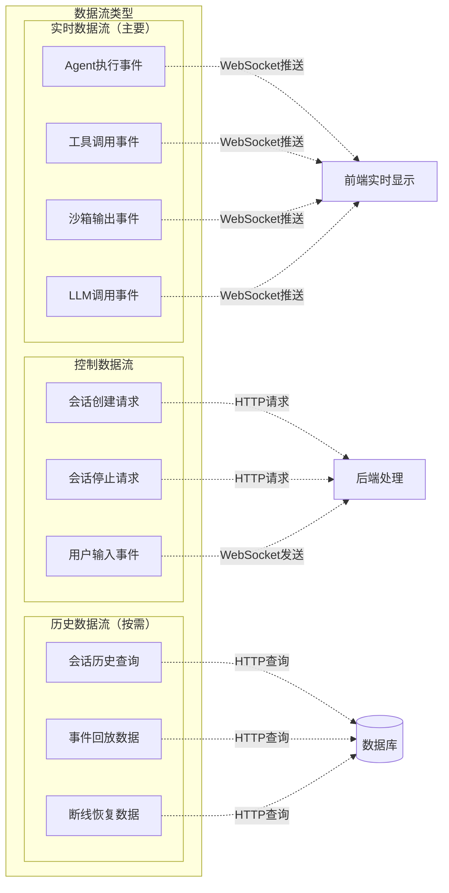
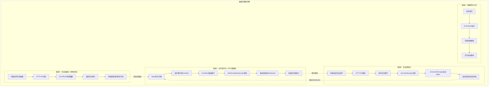
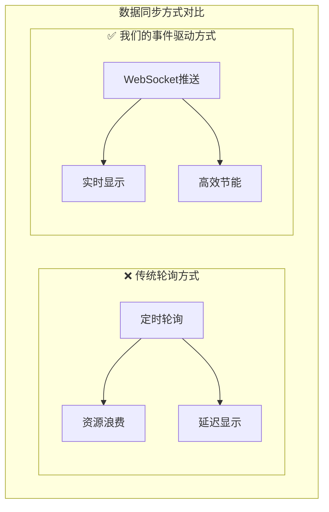
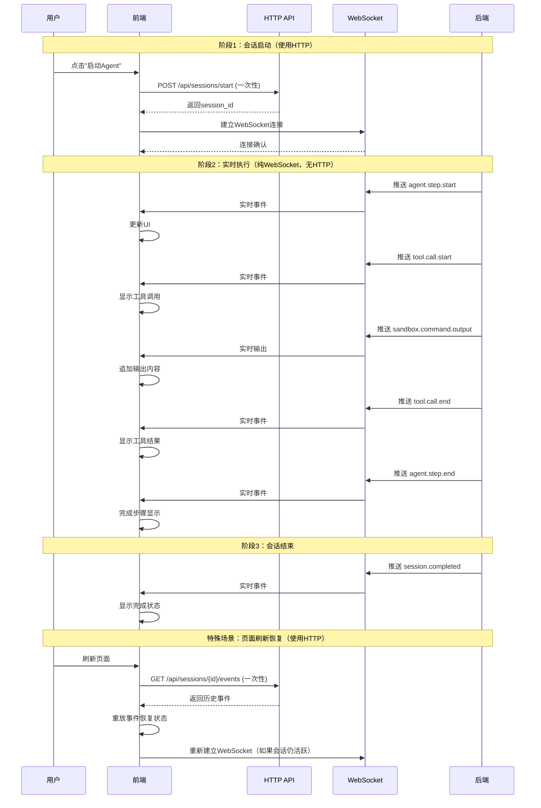

# OpenManus 项目优化方案

## 1. 优化目标

### 1.1 核心目标
- **会话管理**: 实现完整的会话生命周期管理，支持会话创建、执行、暂停、恢复和清理
- **数据持久化**: 保存执行过程中的所有关键数据，支持会话恢复和历史查看
- **实时跟踪**: 前端能够实时显示Agent执行的每一个步骤，包括输入、输出和工具调用结果
- **最小侵入**: 在不破坏现有架构的前提下，通过扩展方式实现新功能

### 1.2 设计原则
- **事件驱动**: 所有组件通过事件总线进行通信，实现完全解耦
- **可选启用**: 通过配置控制是否启用实时跟踪功能
- **标准化数据**: 统一的事件和数据格式，便于前端渲染和后续扩展
- **高可用性**: 单个组件故障不影响整体系统运行

## 2. 架构设计

### 2.1 整体架构

采用完全事件驱动的架构，所有组件都是事件的生产者和消费者：

```
┌─────────────────────────────────────────────────────────────┐
│                        事件总线 (EventBus)                   │
│                         事件路由中心                          │
└─────────────────────────────────────────────────────────────┘
           ↑                    ↑                    ↑
    ┌─────────────┐    ┌─────────────┐    ┌─────────────┐
    │ 事件生产者   │    │ 事件消费者   │    │ 双向组件     │
    │             │    │             │    │             │
    │ • API Handler│    │ • Event Store│    │ • Agent     │
    │ • Agent      │    │ • WebSocket  │    │ • Session   │
    │ • Tools      │    │ • Persistence│    │ • Execution │
    │ • LLM        │    │ • Monitor    │    │ • Sandbox   │
    │ • Frontend   │    │             │    │             │
    └─────────────┘    └─────────────┘    └─────────────┘
```

### 2.2 核心组件

#### **事件总线 (EventBus)**
- 中央事件路由器，负责事件的发布、订阅和分发
- 支持事件类型订阅和组件订阅
- 提供事件队列和异步处理机制
- 支持事件关联和错误处理

#### **会话管理器 (SessionManager)**
- 管理会话的完整生命周期
- 处理会话创建、启动、停止和清理请求
- 维护会话状态和元数据
- 协调各组件的会话相关操作

#### **执行管理器 (ExecutionManager)**
- 负责Agent的创建和执行
- 管理运行中的Agent实例
- 处理执行请求和停止请求
- 监控Agent执行状态

#### **沙箱管理器 (SandboxManager)**
- 管理Docker沙箱的生命周期
- 处理命令执行和文件操作请求
- 提供实时输出流和资源监控
- 确保沙箱安全和资源限制

#### **实时广播器 (WebSocketBroadcaster)**
- 管理WebSocket连接
- 将事件实时推送给前端客户端
- 处理客户端消息并转换为事件
- 支持多客户端连接和会话隔离

#### **事件存储器 (EventStore)**
- 持久化存储所有事件数据
- 提供事件查询和检索功能
- 支持会话历史回放
- 实现数据压缩和清理策略

### 2.3 数据流设计

#### **整体数据流架构**



#### **数据流类型说明**



#### **详细数据流路径**



## 3. 事件系统设计

### 3.1 事件类型定义

事件采用分层命名规范：`<组件>.<操作>.<状态>`

#### **会话管理事件**
```
session.create.request    # 会话创建请求
session.created          # 会话已创建
session.start.request    # 会话启动请求
session.started          # 会话已启动
session.stop.request     # 会话停止请求
session.stopped          # 会话已停止
session.error            # 会话错误
```

#### **Agent执行事件**
```
agent.step.start         # 步骤开始
agent.step.end           # 步骤结束
agent.thinking           # Agent思考中
agent.decision           # Agent决策
```

#### **工具执行事件**
```
tool.call.request        # 工具调用请求
tool.call.start          # 工具调用开始
tool.call.end            # 工具调用结束
tool.call.error          # 工具调用错误
```

#### **LLM调用事件**
```
llm.call.request         # LLM调用请求
llm.call.start           # LLM调用开始
llm.call.end             # LLM调用结束
llm.call.error           # LLM调用错误
```

#### **沙箱操作事件**
```
sandbox.create.request   # 沙箱创建请求
sandbox.created          # 沙箱已创建
sandbox.command.request  # 命令执行请求
sandbox.command.start    # 命令开始执行
sandbox.command.output   # 命令实时输出
sandbox.command.end      # 命令执行结束
sandbox.resource.usage   # 资源使用情况
sandbox.cleanup.request  # 沙箱清理请求
```

#### **用户交互事件**
```
user.input               # 用户输入
user.feedback            # 用户反馈
```

#### **系统事件**
```
system.status            # 系统状态
system.error             # 系统错误
store.event              # 存储事件
broadcast.to_client      # 广播给客户端
```

### 3.2 事件数据结构

```python
class Event(BaseModel):
    event_id: str = Field(default_factory=lambda: str(uuid.uuid4()))
    event_type: EventType
    timestamp: datetime = Field(default_factory=datetime.now)
    session_id: Optional[str] = None
    source: str  # 事件来源组件
    target: Optional[str] = None  # 目标组件（可选）
    data: Dict[str, Any] = Field(default_factory=dict)
    correlation_id: Optional[str] = None  # 用于关联相关事件
```

### 3.3 事件总线实现

```python
class EventBus:
    def __init__(self):
        self.subscribers: Dict[EventType, List[Callable]] = defaultdict(list)
        self.component_subscribers: Dict[str, List[Callable]] = defaultdict(list)
        self.event_queue = asyncio.Queue()
        self.running = False

    async def publish(self, event: Event):
        """发布事件到队列"""
        await self.event_queue.put(event)

    def subscribe(self, event_type: EventType, handler: Callable):
        """订阅特定类型的事件"""
        self.subscribers[event_type].append(handler)

    def subscribe_component(self, component_name: str, handler: Callable):
        """订阅来自特定组件的所有事件"""
        self.component_subscribers[component_name].append(handler)

    async def _process_events(self):
        """事件处理循环"""
        while self.running:
            event = await self.event_queue.get()
            await self._handle_event(event)
```

## 4. 组件实现方案

### 4.1 会话管理器

**职责**：
- 处理会话生命周期管理
- 维护会话状态和元数据
- 协调沙箱创建和清理

**关键方法**：
```python
class SessionManager:
    async def _on_create_session(self, event: Event):
        """处理会话创建请求"""
        # 1. 创建会话实例
        # 2. 保存到数据库
        # 3. 发布会话创建成功事件
        # 4. 触发沙箱创建（如果需要）
        # 5. 发布会话启动请求

    async def _on_stop_session(self, event: Event):
        """处理会话停止请求"""
        # 1. 更新会话状态
        # 2. 转发停止请求给执行管理器
        # 3. 触发沙箱清理
```

### 4.2 执行管理器

**职责**：
- 创建和管理Agent实例
- 处理Agent执行请求
- 监控Agent执行状态

**关键方法**：
```python
class ExecutionManager:
    async def _start_agent_execution(self, event: Event):
        """启动Agent执行"""
        # 1. 根据类型创建Agent实例
        # 2. 注入事件总线和会话ID
        # 3. 发布启动成功事件
        # 4. 在后台任务中运行Agent

    async def _run_agent(self, agent: BaseAgent, prompt: str):
        """运行Agent"""
        # 1. 调用agent.run()
        # 2. 处理执行结果
        # 3. 发布完成或错误事件
        # 4. 清理资源
```

### 4.3 沙箱管理器

**职责**：
- 管理Docker沙箱生命周期
- 处理命令执行和文件操作
- 提供实时输出和资源监控

**关键方法**：
```python
class SandboxEventManager:
    async def _execute_command(self, event: Event):
        """执行命令"""
        # 1. 验证沙箱存在
        # 2. 发布命令开始事件
        # 3. 执行命令（支持流式输出）
        # 4. 发布实时输出事件
        # 5. 发布命令结束事件

    async def _monitor_sandbox_resources(self, session_id: str):
        """监控沙箱资源"""
        # 1. 定期获取容器统计信息
        # 2. 计算CPU和内存使用率
        # 3. 发布资源使用事件
```

### 4.4 实时广播器

**职责**：
- 管理WebSocket连接
- 实时推送事件给前端
- 处理客户端消息

**关键方法**：
```python
class WebSocketBroadcaster:
    async def _broadcast_event(self, event: Event):
        """广播事件到WebSocket客户端"""
        # 1. 检查事件是否需要广播
        # 2. 格式化广播数据
        # 3. 发送给对应会话的所有连接
        # 4. 处理连接异常

    async def _handle_client_message(self, session_id: str, message: Dict):
        """处理客户端消息"""
        # 1. 解析客户端消息
        # 2. 转换为相应的事件
        # 3. 发布到事件总线
```

### 4.5 现有组件改造

#### **BaseAgent改造**
```python
class BaseAgent(BaseModel, ABC):
    # 新增属性
    event_bus: Optional[EventBus] = None
    session_id: Optional[str] = None

    async def run(self, request: Optional[str] = None) -> str:
        """事件驱动的执行循环"""
        # 在关键节点发布事件：
        # 1. 步骤开始事件
        # 2. 思考过程事件
        # 3. 工具调用事件
        # 4. 步骤结束事件

    async def _publish_event(self, event_type: EventType, data: Dict[str, Any]):
        """发布事件的统一方法"""
        if self.event_bus and self.session_id:
            event = Event(
                event_type=event_type,
                source=f"agent_{self.name}",
                session_id=self.session_id,
                data=data
            )
            await self.event_bus.publish(event)
```

#### **工具系统改造**
```python
class ToolCollection:
    async def execute(self, *, name: str, tool_input: Dict[str, Any] = None,
                     event_bus: Optional[EventBus] = None,
                     session_id: Optional[str] = None) -> ToolResult:
        """事件驱动的工具执行"""
        # 1. 发布工具调用开始事件
        # 2. 执行工具
        # 3. 发布工具调用结束事件
        # 4. 返回结果
```

#### **LLM系统改造**
```python
class LLM:
    async def ask(self, messages: List[Union[dict, Message]],
                  event_bus: Optional[EventBus] = None,
                  session_id: Optional[str] = None, **kwargs) -> str:
        """事件驱动的LLM调用"""
        # 1. 发布LLM调用开始事件
        # 2. 执行LLM调用
        # 3. 处理流式响应（如果启用）
        # 4. 发布LLM调用结束事件
```

## 5. 前后端交互设计

### 5.1 数据同步机制说明

#### **核心原理：事件驱动 + 主动推送**
我们采用 **"WebSocket实时推送 + HTTP按需查询"** 的模式，**不使用轮询**：

- **主要方式**：WebSocket实时推送（99%的数据同步）
- **辅助方式**：HTTP一次性查询（特定场景使用）



#### **HTTP API使用场景（非轮询）**
HTTP API只在以下特定场景使用，都是**一次性请求**：

1. **会话初始化**：创建新会话（一次性）
2. **页面恢复**：刷新页面时恢复状态（一次性）
3. **历史查询**：查看过往会话（按需）
4. **断线恢复**：重连后同步丢失数据（一次性）

### 5.2 API接口设计

#### **会话管理API**
```python
# 启动新会话（一次性调用）
POST /api/sessions/start
{
    "prompt": "用户输入的任务",
    "agent_type": "manus|swe|browser|mcp",
    "config": {
        "max_steps": 20,
        "use_sandbox": true,
        "sandbox_config": {...}
    }
}

# 响应
{
    "session_id": "uuid",
    "status": "started",
    "websocket_url": "/ws/{session_id}"
}

# 获取会话信息（按需查询）
GET /api/sessions/{session_id}

# 获取会话事件历史（页面恢复时使用）
GET /api/sessions/{session_id}/events?since={timestamp}&limit={count}

# 获取会话列表（用户查看历史时使用）
GET /api/sessions?status={active|completed}&limit={count}

# 停止会话（一次性操作）
POST /api/sessions/{session_id}/stop

# 继续会话（用户输入）
POST /api/sessions/{session_id}/continue
{
    "user_input": "用户的新输入"
}
```

### 5.3 WebSocket实时通信

#### **连接建立**
```javascript
// 建立WebSocket连接后，所有实时数据都通过此通道
const ws = new WebSocket(`ws://localhost:8000/ws/${sessionId}`);
```

#### **服务端推送事件格式**
```json
{
    "event_type": "agent.step.start",
    "timestamp": "2024-01-01T10:00:00Z",
    "session_id": "uuid",
    "data": {
        "step_number": 1,
        "max_steps": 20
    }
}
```

#### **客户端发送消息格式**
```json
{
    "type": "user_input",
    "data": {
        "input": "用户输入的内容"
    }
}
```

### 5.4 前端数据同步实现

#### **主要同步类：实时数据同步**
```javascript
class RealTimeDataSync {
    constructor() {
        this.websocket = null;
        this.eventBuffer = [];  // 事件缓冲区
        this.uiState = {
            currentStep: 0,
            agentStatus: 'idle',
            steps: [],
            toolCalls: [],
            sandboxOutput: []
        };
    }

    // 建立WebSocket连接 - 主要数据同步方式
    async connectWebSocket(sessionId) {
        this.websocket = new WebSocket(`ws://localhost:8000/ws/${sessionId}`);

        // 所有实时数据都通过WebSocket推送，无需轮询
        this.websocket.onmessage = (event) => {
            const eventData = JSON.parse(event.data);
            this.handleRealtimeEvent(eventData);
        };

        this.websocket.onopen = () => {
            console.log('实时数据同步已建立');
        };

        this.websocket.onclose = () => {
            console.log('连接断开，尝试重连...');
            this.attemptReconnect();
        };
    }

    // 处理实时事件 - 核心同步逻辑
    handleRealtimeEvent(eventData) {
        const { event_type, timestamp, data } = eventData;

        // 1. 缓存事件（用于断线恢复）
        this.eventBuffer.push(eventData);

        // 2. 实时更新UI状态
        this.updateUIState(event_type, data);

        // 3. 触发UI重新渲染
        this.renderUI();
    }

    // 实时更新UI状态
    updateUIState(eventType, data) {
        switch (eventType) {
            case 'agent.step.start':
                this.uiState.currentStep = data.step_number;
                this.uiState.steps[data.step_number - 1] = {
                    number: data.step_number,
                    status: 'running',
                    startTime: new Date(),
                    toolCalls: []
                };
                break;

            case 'tool.call.start':
                const currentStep = this.uiState.steps[this.uiState.currentStep - 1];
                if (currentStep) {
                    currentStep.toolCalls.push({
                        name: data.tool_name,
                        input: data.input,
                        status: 'running'
                    });
                }
                break;

            case 'sandbox.command.output':
                // 实时追加沙箱输出
                this.uiState.sandboxOutput.push({
                    command: data.command,
                    content: data.content,
                    type: data.output_type,
                    timestamp: new Date()
                });
                break;

            case 'tool.call.end':
                // 更新工具调用结果
                const step = this.uiState.steps[this.uiState.currentStep - 1];
                if (step) {
                    const toolCall = step.toolCalls.find(tc => tc.name === data.tool_name);
                    if (toolCall) {
                        toolCall.status = 'completed';
                        toolCall.result = data.result;
                    }
                }
                break;
        }
    }
}
```

#### **辅助同步类：历史数据查询**
```javascript
class HistoryDataSync {
    constructor() {
        this.httpClient = new HTTPClient();
    }

    // 页面刷新时恢复会话状态（一次性查询）
    async restoreSessionState(sessionId) {
        try {
            const events = await this.httpClient.get(`/api/sessions/${sessionId}/events`);
            return this.replayEvents(events.data);
        } catch (error) {
            console.error('恢复会话状态失败:', error);
            return null;
        }
    }

    // 断线重连后同步丢失数据（一次性查询）
    async syncMissedData(sessionId, lastEventTime) {
        try {
            const response = await this.httpClient.get(
                `/api/sessions/${sessionId}/events?since=${lastEventTime}`
            );
            return response.data;
        } catch (error) {
            console.error('同步丢失数据失败:', error);
            return [];
        }
    }

    // 获取会话列表（按需查询）
    async getSessionList() {
        const response = await this.httpClient.get('/api/sessions');
        return response.data;
    }

    // 事件重放恢复状态
    replayEvents(events) {
        const state = { steps: [], toolCalls: [], currentStep: 0 };

        events.forEach(event => {
            switch (event.event_type) {
                case 'agent.step.start':
                    state.steps[event.data.step_number - 1] = {
                        number: event.data.step_number,
                        toolCalls: []
                    };
                    state.currentStep = event.data.step_number;
                    break;
                // ... 其他事件处理
            }
        });

        return state;
    }
}
```

#### **统一状态管理器**
```javascript
class StateManager {
    constructor() {
        this.state = {
            sessions: new Map(),      // 所有会话状态
            currentSession: null      // 当前活跃会话
        };

        this.realTimeSync = new RealTimeDataSync();
        this.historySync = new HistoryDataSync();
        this.subscribers = new Map(); // UI组件订阅者
    }

    // 启动新会话 - 完整的数据同步流程
    async startSession(prompt, agentType, config) {
        // 1. HTTP API创建会话（一次性）
        const response = await fetch('/api/sessions/start', {
            method: 'POST',
            headers: { 'Content-Type': 'application/json' },
            body: JSON.stringify({ prompt, agent_type: agentType, config })
        });

        const sessionInfo = await response.json();
        const sessionId = sessionInfo.session_id;

        // 2. 初始化会话状态
        this.state.sessions.set(sessionId, {
            id: sessionId,
            info: sessionInfo,
            realTimeState: {},
            isActive: true
        });

        this.state.currentSession = sessionId;

        // 3. 建立WebSocket实时连接（主要数据同步方式）
        await this.realTimeSync.connectWebSocket(sessionId);

        // 4. 设置实时事件处理
        this.realTimeSync.on('*', (eventType, data) => {
            this.updateSessionState(sessionId, eventType, data);
            this.notifyUIUpdate(eventType, { sessionId, data });
        });

        return sessionId;
    }

    // 恢复历史会话
    async restoreSession(sessionId) {
        // 1. HTTP API获取历史数据（一次性）
        const restoredState = await this.historySync.restoreSessionState(sessionId);

        if (restoredState) {
            // 2. 恢复会话状态
            this.state.sessions.set(sessionId, {
                id: sessionId,
                realTimeState: restoredState,
                isActive: false // 历史会话
            });

            this.state.currentSession = sessionId;
            this.notifyUIUpdate('session_restored', { sessionId });
        }
    }

    // 处理断线重连
    async handleReconnection(sessionId) {
        const lastEventTime = this.getLastEventTime(sessionId);

        // HTTP API同步丢失数据（一次性）
        const missedEvents = await this.historySync.syncMissedData(sessionId, lastEventTime);

        // 重放丢失的事件
        missedEvents.forEach(event => {
            this.realTimeSync.handleRealtimeEvent(event);
        });

        console.log(`重连成功，同步了 ${missedEvents.length} 个事件`);
    }

    // 更新会话状态
    updateSessionState(sessionId, eventType, data) {
        const session = this.state.sessions.get(sessionId);
        if (!session) return;

        // 根据事件类型更新状态
        if (!session.realTimeState.steps) {
            session.realTimeState.steps = [];
        }

        switch (eventType) {
            case 'agent.step.start':
                session.realTimeState.currentStep = data.step_number;
                session.realTimeState.steps[data.step_number - 1] = {
                    number: data.step_number,
                    status: 'running',
                    toolCalls: []
                };
                break;

            case 'session.completed':
                session.isActive = false;
                session.realTimeState.status = 'completed';
                break;
        }
    }

    // 通知UI更新
    notifyUIUpdate(eventType, data) {
        this.subscribers.forEach((callbacks) => {
            callbacks.forEach(callback => {
                try {
                    callback(eventType, data, this.state);
                } catch (error) {
                    console.error('UI更新失败:', error);
                }
            });
        });
    }

    // UI组件订阅状态变化
    subscribe(component, callback) {
        if (!this.subscribers.has(component)) {
            this.subscribers.set(component, []);
        }
        this.subscribers.get(component).push(callback);
    }
}
```

#### **断线重连管理器**
```javascript
class ConnectionManager {
    constructor(stateManager) {
        this.stateManager = stateManager;
        this.reconnectAttempts = 0;
        this.maxReconnectAttempts = 5;
        this.reconnectDelay = 1000;
    }

    // 处理WebSocket断线
    async handleDisconnection() {
        console.log('WebSocket连接断开，开始重连...');

        // 通知UI显示断线状态
        this.stateManager.notifyUIUpdate('connection_lost', {});

        // 尝试重连
        await this.attemptReconnect();
    }

    // 重连逻辑
    async attemptReconnect() {
        if (this.reconnectAttempts >= this.maxReconnectAttempts) {
            console.error('重连失败，切换到离线模式');
            this.stateManager.notifyUIUpdate('connection_failed', {});
            return;
        }

        this.reconnectAttempts++;

        try {
            await new Promise(resolve => setTimeout(resolve, this.reconnectDelay));

            const currentSessionId = this.stateManager.state.currentSession;
            if (currentSessionId) {
                // 重新建立WebSocket连接
                await this.stateManager.realTimeSync.connectWebSocket(currentSessionId);

                // 同步断线期间的数据
                await this.stateManager.handleReconnection(currentSessionId);

                this.reconnectAttempts = 0;
                this.stateManager.notifyUIUpdate('connection_restored', {});
            }

        } catch (error) {
            console.error('重连失败:', error);
            this.reconnectDelay *= 2; // 指数退避
            await this.attemptReconnect();
        }
    }
}
```

### 5.5 完整的数据流示例



### 5.6 UI组件数据绑定

```javascript
// React组件示例
class AgentExecutionView extends React.Component {
    constructor(props) {
        super(props);
        this.state = {
            sessionState: null,
            connectionStatus: 'connected'
        };

        // 订阅状态管理器
        this.stateManager = props.stateManager;
        this.stateManager.subscribe('AgentExecutionView', this.handleStateChange.bind(this));
    }

    handleStateChange(eventType, data, globalState) {
        switch (eventType) {
            case 'agent.step.start':
                // 实时显示新步骤
                this.setState({
                    sessionState: this.stateManager.getCurrentSessionState()
                });
                break;

            case 'tool.call.start':
                // 实时显示工具调用
                this.showToolCallInProgress(data.tool_name, data.input);
                break;

            case 'sandbox.command.output':
                // 实时追加沙箱输出
                this.appendSandboxOutput(data.content);
                break;

            case 'connection_lost':
                this.setState({ connectionStatus: 'disconnected' });
                break;

            case 'connection_restored':
                this.setState({ connectionStatus: 'connected' });
                break;
        }
    }

    render() {
        const { sessionState, connectionStatus } = this.state;

        return (
            <div className="agent-execution-view">
                <ConnectionStatus status={connectionStatus} />
                {sessionState && (
                    <>
                        <SessionInfo session={sessionState.info} />
                        <StepsDisplay
                            steps={sessionState.realTimeState.steps || []}
                            currentStep={sessionState.realTimeState.currentStep}
                        />
                        <SandboxOutput
                            output={sessionState.realTimeState.sandboxOutput || []}
                        />
                    </>
                )}
            </div>
        );
    }
}
```

### 5.7 数据同步优势总结

#### **与传统轮询方式对比**

| 特性 | 传统轮询 | 我们的事件驱动 |
|------|----------|----------------|
| **实时性** | 有延迟（轮询间隔） | 真正实时（事件推送） |
| **资源消耗** | 高（持续请求） | 低（按需推送） |
| **服务器压力** | 大（频繁查询） | 小（事件驱动） |
| **网络流量** | 浪费（空轮询） | 高效（有数据才传输） |
| **用户体验** | 卡顿感 | 流畅实时 |

#### **我们方案的核心优势**

1. **真正实时**：事件发生立即推送，无延迟
2. **高效节能**：只在有数据时才传输，无浪费
3. **断线恢复**：自动重连并同步丢失数据
4. **状态一致**：前后端状态完全同步
5. **用户友好**：流畅的实时体验

## 6. 数据持久化方案

### 6.1 数据库设计

#### **会话表 (sessions)**
```sql
CREATE TABLE sessions (
    session_id VARCHAR(36) PRIMARY KEY,
    agent_name VARCHAR(50) NOT NULL,
    created_at TIMESTAMP DEFAULT CURRENT_TIMESTAMP,
    updated_at TIMESTAMP DEFAULT CURRENT_TIMESTAMP ON UPDATE CURRENT_TIMESTAMP,
    status VARCHAR(20) NOT NULL,
    config JSON,
    result TEXT,
    error_message TEXT
);
```

#### **事件表 (events)**
```sql
CREATE TABLE events (
    event_id VARCHAR(36) PRIMARY KEY,
    session_id VARCHAR(36) NOT NULL,
    event_type VARCHAR(50) NOT NULL,
    timestamp TIMESTAMP DEFAULT CURRENT_TIMESTAMP,
    source VARCHAR(50) NOT NULL,
    target VARCHAR(50),
    data JSON,
    correlation_id VARCHAR(36),
    FOREIGN KEY (session_id) REFERENCES sessions(session_id),
    INDEX idx_session_timestamp (session_id, timestamp),
    INDEX idx_event_type (event_type),
    INDEX idx_correlation (correlation_id)
);
```

### 6.2 事件存储器

```python
class EventStore:
    def __init__(self, event_bus: EventBus, db: SessionDatabase):
        self.event_bus = event_bus
        self.db = db

        # 订阅所有事件进行存储
        self.event_bus.subscribe_component("*", self._store_event)

    async def _store_event(self, event: Event):
        """存储事件到数据库"""
        await self.db.save_event(event)

    async def get_session_events(self, session_id: str,
                                event_types: Optional[List[str]] = None,
                                limit: int = 1000) -> List[Event]:
        """获取会话的事件历史"""
        return await self.db.get_events(session_id, event_types, limit)

    async def replay_session(self, session_id: str) -> AsyncGenerator[Event, None]:
        """回放会话事件"""
        events = await self.get_session_events(session_id)
        for event in events:
            yield event
```

### 6.3 文件存储

```python
class FileStorage:
    def __init__(self, base_path: str = "data/sessions"):
        self.base_path = Path(base_path)
        self.base_path.mkdir(parents=True, exist_ok=True)

    def get_session_path(self, session_id: str) -> Path:
        """获取会话文件存储路径"""
        session_path = self.base_path / session_id
        session_path.mkdir(exist_ok=True)
        return session_path

    async def save_file(self, session_id: str, filename: str, content: bytes):
        """保存会话相关文件"""
        file_path = self.get_session_path(session_id) / filename
        file_path.write_bytes(content)

    async def get_file(self, session_id: str, filename: str) -> Optional[bytes]:
        """获取会话相关文件"""
        file_path = self.get_session_path(session_id) / filename
        if file_path.exists():
            return file_path.read_bytes()
        return None
```

## 7. 配置扩展

### 7.1 配置文件扩展

```toml
# config.toml 新增配置
[real_time]
enabled = true                    # 是否启用实时跟踪
api_port = 8000                  # API服务端口
websocket_enabled = true         # 是否启用WebSocket
store_events = true              # 是否存储事件
max_events_per_session = 1000    # 每个会话最大事件数
broadcast_all_events = false     # 是否广播所有事件

[storage]
database_path = "data/sessions.db"     # 数据库文件路径
file_storage_path = "data/files"       # 文件存储路径
event_retention_days = 30              # 事件保留天数
auto_cleanup = true                    # 是否自动清理过期数据

[websocket]
max_connections_per_session = 5   # 每个会话最大连接数
heartbeat_interval = 30           # 心跳间隔（秒）
message_size_limit = 1048576      # 消息大小限制（字节）

[sandbox]
# 现有沙箱配置保持不变
# 新增事件相关配置
enable_resource_monitoring = true  # 是否启用资源监控
resource_check_interval = 5        # 资源检查间隔（秒）
enable_command_streaming = true    # 是否启用命令流式输出
```

### 7.2 配置类扩展

```python
class RealTimeSettings(BaseModel):
    enabled: bool = Field(True, description="是否启用实时跟踪")
    api_port: int = Field(8000, description="API服务端口")
    websocket_enabled: bool = Field(True, description="是否启用WebSocket")
    store_events: bool = Field(True, description="是否存储事件")
    max_events_per_session: int = Field(1000, description="每个会话最大事件数")
    broadcast_all_events: bool = Field(False, description="是否广播所有事件")

class StorageSettings(BaseModel):
    database_path: str = Field("data/sessions.db", description="数据库文件路径")
    file_storage_path: str = Field("data/files", description="文件存储路径")
    event_retention_days: int = Field(30, description="事件保留天数")
    auto_cleanup: bool = Field(True, description="是否自动清理过期数据")

class WebSocketSettings(BaseModel):
    max_connections_per_session: int = Field(5, description="每个会话最大连接数")
    heartbeat_interval: int = Field(30, description="心跳间隔（秒）")
    message_size_limit: int = Field(1048576, description="消息大小限制（字节）")

# 扩展主配置类
class AppConfig(BaseModel):
    # 现有配置...
    real_time: Optional[RealTimeSettings] = Field(None, description="实时跟踪配置")
    storage: Optional[StorageSettings] = Field(None, description="存储配置")
    websocket: Optional[WebSocketSettings] = Field(None, description="WebSocket配置")
```

## 8. 实施计划

### 8.1 实施阶段

#### **第一阶段：基础事件系统（1-2周）**
1. **事件模型设计**
   - 定义事件类型枚举
   - 实现Event数据模型
   - 创建事件总线EventBus

2. **核心组件框架**
   - 实现SessionManager基础框架
   - 实现ExecutionManager基础框架
   - 实现SandboxEventManager基础框架

3. **数据存储基础**
   - 设计数据库表结构
   - 实现EventStore基础功能
   - 实现FileStorage基础功能

#### **第二阶段：Agent系统集成（2-3周）**
1. **Agent改造**
   - 修改BaseAgent支持事件发布
   - 在关键执行点添加事件发布
   - 测试Agent事件发布功能

2. **工具系统改造**
   - 修改ToolCollection支持事件
   - 改造主要工具类（Python、Bash、Editor等）
   - 实现工具执行事件跟踪

3. **LLM系统改造**
   - 修改LLM类支持事件发布
   - 实现LLM调用过程跟踪
   - 支持流式响应事件

#### **第三阶段：沙箱事件集成（2周）**
1. **沙箱事件管理器**
   - 实现完整的SandboxEventManager
   - 支持命令执行事件跟踪
   - 实现资源监控事件

2. **流式输出支持**
   - 修改DockerSandbox支持流式输出
   - 实现实时命令输出事件
   - 测试长时间运行命令的跟踪

#### **第四阶段：API和WebSocket服务（2周）**
1. **HTTP API服务**
   - 实现会话管理API
   - 实现事件查询API
   - 添加会话控制API

2. **WebSocket服务**
   - 实现WebSocketBroadcaster
   - 支持实时事件推送
   - 处理客户端消息

3. **前端集成**
   - 实现前端事件客户端
   - 创建基础UI界面
   - 测试实时事件显示

#### **第五阶段：完善和优化（1-2周）**
1. **错误处理和容错**
   - 完善异常处理机制
   - 实现组件故障恢复
   - 添加监控和告警

2. **性能优化**
   - 优化事件处理性能
   - 实现事件批处理
   - 添加缓存机制

3. **文档和测试**
   - 编写使用文档
   - 添加单元测试
   - 进行集成测试

### 8.2 风险控制

#### **向后兼容性**
- 所有新功能通过配置控制，默认关闭
- 现有API和接口保持不变
- 提供平滑的迁移路径

#### **性能影响**
- 事件处理采用异步队列，不阻塞主流程
- 可配置的事件过滤和批处理
- 数据库连接池和查询优化

#### **故障隔离**
- 事件系统故障不影响核心功能
- 各组件独立运行，互不依赖
- 完善的降级机制

### 8.3 测试策略

#### **单元测试**
- 事件总线功能测试
- 各组件事件处理测试
- 数据存储功能测试

#### **集成测试**
- 端到端事件流测试
- WebSocket连接测试
- 多会话并发测试

#### **性能测试**
- 高频事件处理性能
- 大量并发连接测试
- 长时间运行稳定性测试

## 9. 预期效果

### 9.1 用户体验提升

#### **实时可视化**
- 用户可以实时看到Agent的思考过程
- 每个工具调用的输入输出都清晰可见
- 沙箱命令执行的实时输出显示

#### **会话管理**
- 支持会话暂停和恢复
- 历史会话查看和回放
- 多会话并行执行

#### **错误诊断**
- 详细的执行步骤记录
- 清晰的错误信息和堆栈
- 便于问题定位和调试

### 9.2 开发者体验

#### **可观测性**
- 完整的执行链路跟踪
- 详细的性能指标
- 便于系统监控和调试

#### **可扩展性**
- 新组件可以轻松集成事件系统
- 标准化的事件接口
- 便于添加新功能

#### **可维护性**
- 组件间完全解耦
- 清晰的事件流向
- 便于问题排查和修复

### 9.3 系统能力提升

#### **并发处理**
- 支持多会话并行执行
- 事件异步处理不阻塞
- 更好的资源利用率

#### **数据价值**
- 完整的执行数据记录
- 支持数据分析和挖掘
- 便于系统优化和改进

#### **生态扩展**
- 标准化的事件接口便于第三方集成
- 支持插件化扩展
- 为未来功能扩展奠定基础

## 10. 总结

本优化方案通过引入完全事件驱动的架构，在保持现有系统稳定性的前提下，实现了以下核心目标：

1. **完整的会话管理和数据持久化**：支持会话的完整生命周期管理和历史数据保存
2. **实时的执行过程跟踪**：前端可以实时显示Agent执行的每一个细节
3. **高度的系统解耦**：各组件通过事件通信，提高了系统的可维护性和可扩展性
4. **最小的侵入性改造**：通过扩展而非修改的方式实现新功能

该方案不仅解决了当前的需求，还为OpenManus项目的未来发展奠定了坚实的基础，使其能够更好地支持复杂的AI应用场景和社区生态建设。
